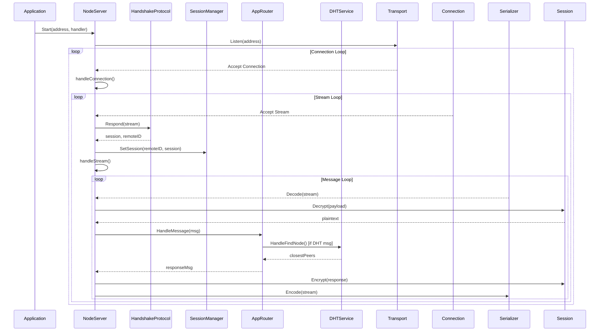
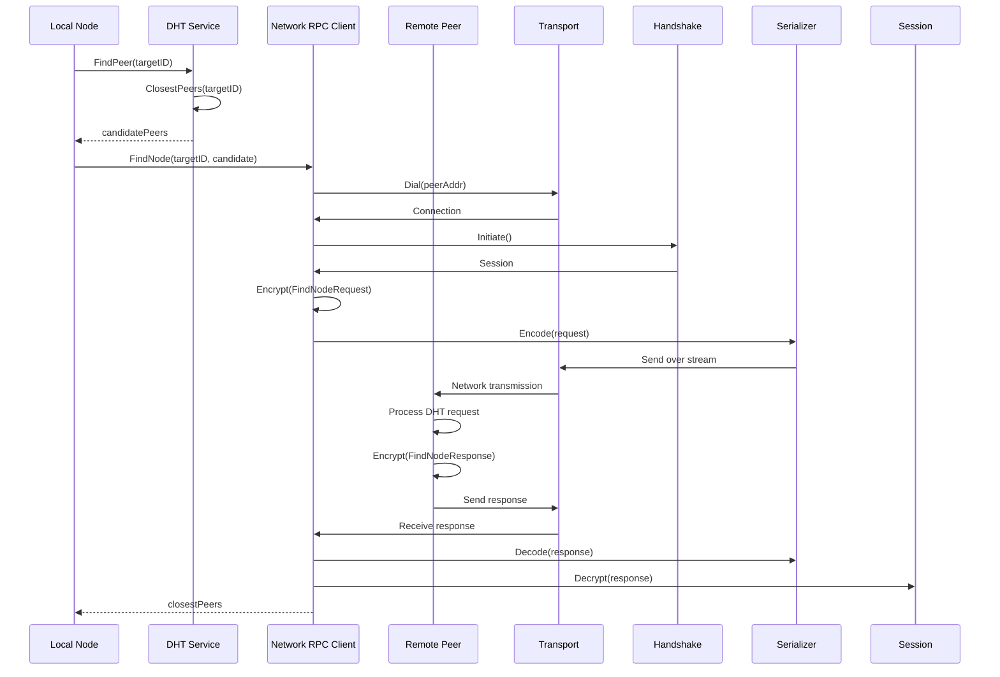

# DP2PTCS (Decentralized Peer-2-Peer Tactical Communication System) - Technical Documentation

## 1. System Overview

### Purpose

DP2PTCS is a decentralized peer-to-peer communication system designed for high-stakes tactical environments where traditional centralized networks are vulnerable to single points of failure. The system eliminates centralized command-and-control servers by distributing network logic across every participating node, ensuring survivability even when physical infrastructure is compromised.

### Core Features and Responsibilities

- **Decentralized Peer Discovery**: Kademlia DHT-based peer location without central directories
- **Resilient Transport**: QUIC protocol over UDP for connection migration and multiplexing
- **End-to-End Encryption**: X3DH key exchange + Double Ratchet algorithm for PFS and PCS
- **Metadata Protection**: Intermediate routing and cover traffic to obscure communication patterns
- **Fault Tolerance**: Store-and-forward messaging for disconnected networks
- **Zero-Trust Identity**: Self-sovereign Ed25519 identities with QR code verification

### High-Level Architecture

The system follows a layered, modular stack architecture:

- **Application Layer**: Message routing and business logic
- **Use Case Layer**: Orchestration of domain operations
- **Domain Layer**: Core business entities and interfaces
- **Infrastructure Layer**: Transport, cryptography, and persistence

This is a monolithic application with decoupled modules, not a microservices architecture. All components run within a single Go process per node.

## 2. Architecture Breakdown

### Major Components/Modules and Their Responsibilities

| Module | Location | Responsibility |
| --- | --- | --- |
| node | Entry point | Application initialization, dependency injection, graceful shutdown |
| domain | Domain entities | Core types (Peer, Discoverer interface) |
| crypto | Cryptographic operations | Identity generation, X3DH/Double Ratchet encryption, key storage |
| dht | Distributed Hash Table | Kademlia routing table, peer discovery, RPC client |
| handshake | Secure session establishment | X3DH protocol implementation |
| messaging | Message framing | Protobuf serialization, message types |
| network | Network adapters | Kademlia discoverer implementation |
| transport | Transport abstraction | QUIC transport layer |
| usecase | Business logic orchestration | Identity management, connection handling, node server |

### Directory Structure Explanation

```
dp2ptcs/
├── cmd/node/           # Application entry point
│   ├── main.go        # Dependency injection and startup
│   ├── app_router.go  # Message routing logic
│   └── main_test.go   # Integration tests
├── internal/           # Private application code
│   ├── crypto/        # Cryptographic primitives
│   ├── dht/           # Kademlia DHT implementation
│   ├── domain/        # Domain entities and interfaces
│   ├── handshake/     # X3DH handshake protocol
│   ├── messaging/     # Message serialization
│   │   └── pb/        # Protocol Buffer definitions
│   ├── network/       # Network discovery adapters
│   ├── transport/     # QUIC transport layer
│   └── usecase/       # Business use cases
├── go.mod             # Go module definition
├── go.sum             # Dependency checksums
├── LICENSE            # MIT license
└── README.md          # Project overview
```

### Technologies, Frameworks, and Libraries Used

- **Go 1.25.0**: Primary programming language
- **quic-go**: UDP-based QUIC transport for multiplexed connections
- **golang.org/x/crypto**: ChaCha20-Poly1305, Curve25519, HKDF, Argon2id
- **google.golang.org/protobuf**: Efficient message serialization
- **golang.org/x/net**: Network utilities
- **golang.org/x/sys**: OS-specific operations

### Design Patterns Identified

- **Clean Architecture**: Strict separation of domain, use case, and infrastructure layers
- **Dependency Injection**: Constructor-based injection in main.go
- **Interface Segregation**: Small, focused interfaces (Discoverer, Transport, Serializer)
- **Repository Pattern**: IdentityStore abstraction for key persistence
- **Strategy Pattern**: Pluggable transport and serialization implementations
- **Observer Pattern**: MessageHandler callback for extensible message processing

## 3. Data Flow & Execution Flow

### End-to-End Request Lifecycle

1. **Node Initialization**: Load/create Ed25519 identity, generate ephemeral TLS cert
2. **Network Bootstrap**: Connect to known peer, populate DHT routing table
3. **Connection Establishment**: QUIC dial/listen, X3DH handshake on new streams
4. **Message Processing**: Deserialize protobuf, decrypt with Double Ratchet, route to handler
5. **Response Generation**: Encrypt response, serialize, send over stream

### Control Flow Between Components



### Data Transformations at Each Stage

- **Transport**: Raw UDP packets → QUIC streams
- **Handshake**: Public keys → Shared secret via X3DH
- **Messaging**: Protobuf bytes → Domain Message struct
- **Crypto**: Ciphertext + headers → Plaintext via Double Ratchet
- **Application**: Typed messages → Business actions (DHT queries, commands)

### Sequence Diagrams

#### Peer Discovery Flow



## 4. Component-Level Deep Dive

### cmd/node

**Responsibilities**: Application bootstrap, dependency wiring, graceful shutdown
**Key Classes/Functions**:

- `main()`: OS signal handling, context management
- `run()`: Dependency injection and execution
- `AppRouter`: Routes messages to appropriate handlers
  **Internal Workflows**: Initialize crypto → Setup transport → Bootstrap DHT → Start server
  **Dependencies**: All internal modules
  **Important Logic**: Context cancellation for clean shutdown

### internal/domain

**Responsibilities**: Define core business entities and contracts
**Key Classes/Functions**:

- `Peer`: Node representation with ID and addresses
- `Discoverer`: Interface for peer location
  **Internal Workflows**: N/A (pure data/ contracts)
  **Dependencies**: None
  **Important Logic**: Node ID validation (32 bytes)

### internal/crypto

**Responsibilities**: Cryptographic primitives and secure storage
**Key Classes/Functions**:

- `Identity`: Ed25519 keypair + NodeID (SHA256 hash of pubkey)
- `DoubleRatchetSession`: Thread-safe PFS/PCS encryption
- `RootChain`: HKDF-based key evolution
- `KDFChain`: Message key derivation
- `IdentityStore`: File-based encrypted key storage
  **Internal Workflows**:
- X3DH: 3 DH computations → HKDF → Root key
- Double Ratchet: DH ratchet on key change, message ratchet for each encrypt
  **Dependencies**: golang.org/x/crypto
  **Important Logic**: Argon2id key derivation, AES-GCM encryption at rest

### internal/dht

**Responsibilities**: Kademlia DHT implementation for peer discovery
**Key Classes/Functions**:

- `RoutingTable`: 256 k-buckets for XOR-distance organization
- `DHTService`: Local DHT query handling
- `NetworkRPCClient`: Remote DHT operations over secure streams
- `LookupTask`: Iterative peer discovery
  **Internal Workflows**: Bucket index calculation, closest peer sorting
  **Dependencies**: internal/crypto, internal/transport
  **Important Logic**: XOR distance metric, k-bucket management

### internal/handshake

**Responsibilities**: X3DH protocol for initial key agreement
**Key Classes/Functions**:

- `HandshakeProtocol`: Initiate/Respond methods
- `HandshakeExchange`: Public key serialization
  **Internal Workflows**: Ephemeral key generation → Key exchange → X3DH computation
  **Dependencies**: internal/crypto
  **Important Logic**: Symmetric DH calculations for PFS

### internal/messaging

**Responsibilities**: Message framing and serialization
**Key Classes/Functions**:

- `Message`: Domain message with headers and payload
- `ProtobufSerializer`: Varint-prefixed protobuf encoding
  **Internal Workflows**: Marshal/unmarshal with protobuf
  **Dependencies**: google.golang.org/protobuf
  **Important Logic**: Length-prefixed framing for stream safety

### internal/network

**Responsibilities**: Network discovery adapters
**Key Classes/Functions**:

- `KademliaDiscoverer`: DHT-based peer location
  **Internal Workflows**: RPC calls to entry peer
  **Dependencies**: internal/dht
  **Important Logic**: Bootstrap peer configuration

### internal/transport

**Responsibilities**: Network transport abstraction
**Key Classes/Functions**:

- `QUICTransport`: quic-go wrapper
- `GenerateEphemeralTLSConfig()`: Self-signed cert generation
  **Internal Workflows**: QUIC connection/stream management
  **Dependencies**: github.com/quic-go/quic-go
  **Important Logic**: Ephemeral TLS for QUIC (real auth via X3DH)

### internal/usecase

**Responsibilities**: Business logic orchestration
**Key Classes/Functions**:

- `NodeServer`: Connection acceptance and stream handling
- `IdentityManager`: Load/create identities
- `ConnectionManager`: Peer resolution and connection
- `DiscoveryManager`: Network bootstrap
- `InMemorySessionManager`: Session storage
  **Internal Workflows**: Concurrent connection handling, session lifecycle
  **Dependencies**: All infrastructure layers
  **Important Logic**: Race-free session management

## 5. API & Interfaces

### Exposed Interfaces

The system does not expose HTTP/REST APIs. All interfaces are internal Go interfaces:

```go
// internal/domain/discoverer.go
type Discoverer interface {
    FindPeer(id []byte) (*Peer, error)
}

// internal/transport/transport.go
type Transport interface {
    Dial(address string) (Connection, error)
    Listen(address string) (Listener, error)
}

// internal/crypto/keystore.go
type IdentityStore interface {
    Save(id *Identity, passphrase string) error
    Load(passphrase string) (*Identity, error)
}

// internal/messaging/serializer.go
type Serializer interface {
    Encode(w io.Writer, msg Message) error
    Decode(r io.Reader) (Message, error)
}
```
dp2ptcs/
├── cmd/node/           # Application entry point
│   ├── main.go        # Dependency injection and startup
│   ├── app_router.go  # Message routing logic
│   └── main_test.go   # Integration tests
├── internal/           # Private application code
│   ├── crypto/        # Cryptographic primitives
│   ├── dht/           # Kademlia DHT implementation
│   ├── domain/        # Domain entities and interfaces
│   ├── handshake/     # X3DH handshake protocol
│   ├── messaging/     # Message serialization
│   │   └── pb/        # Protocol Buffer definitions
│   ├── network/       # Network discovery adapters
│   ├── transport/     # QUIC transport layer
│   └── usecase/       # Business use cases
├── go.mod             # Go module definition
├── go.sum             # Dependency checksums
├── LICENSE            # MIT license
└── README.md          # Project overview
```

### Request/Response Structure

Messages use Protocol Buffers:

```protobuf
// internal/messaging/pb/message.proto
message TacticalMessage {
  bytes sender_id = 1;
  MessageType type = 2;
  bytes dh_public_key = 3;
  bytes payload = 4;
  uint32 message_number = 5;
  uint32 previous_chain_length = 6;
}

// internal/messaging/pb/dht.proto
message FindNodeRequest {
    bytes target_id = 1;
}
message FindNodeResponse {
    repeated PeerInfo closest_peers = 1;
}
```

### Validation and Error Handling

- Node ID: Must be exactly 32 bytes
- DH keys: Must be 32 bytes (Curve25519)
- Ciphertext: Must contain nonce + encrypted data
- Protobuf: Strict schema validation
- Errors: Custom error types (ErrPeerNotFound, ErrInvalidNodeID)

### Authentication/Authorization Mechanisms

- **Identity Verification**: Out-of-band (QR codes, shared secrets)
- **Message Authentication**: ChaCha20-Poly1305 AEAD
- **Session Establishment**: X3DH mutual authentication
- **No Authorization**: All authenticated peers have equal access

## 6. Data Layer

### Database(s) Used

- **None**: Pure in-memory operation with file-based identity storage
- **Identity Storage**: Encrypted JSON on filesystem (node.key)
- **Session Storage**: In-memory map with mutex protection

### Schema Overview

**Identity File (Encrypted JSON)**:

```json
{
  "salt": "base64-encoded-16-bytes",
  "nonce": "base64-encoded-12-bytes", 
  "ciphertext": "aes-gcm-encrypted-private-key"
}
```

**In-Memory Structures**:

- RoutingTable: 256 buckets of []*Peer
- Sessions: map[string]SecureSession
- Messages: Protobuf-serialized with headers

### ORM/Queries Behavior

- **No ORM**: Direct Go struct manipulation
- **Queries**: Linear search in routing table, map lookups for sessions
- **Persistence**: File I/O for identities, no other persistence

### Data Lifecycle and Persistence Logic

- **Identity**: Generated once, encrypted to disk, loaded on startup
- **Sessions**: Created per peer connection, stored in memory, lost on restart
- **Peers**: Discovered dynamically, cached in routing table
- **Messages**: Ephemeral, no persistence (store-and-forward not implemented)

## 7. Configuration & Environment

### Environment Variables and Their Roles

- **None**: All configuration is hardcoded or passed as arguments
- **Runtime Config**: Listen address, key path, passphrase (from code)

### Config Files and Runtime Behavior

- **go.mod**: Dependency management
- **No config files**: Behavior determined by code constants
- **Key File**: node.key (created if missing)

### Feature Flags

- **None**: All features always enabled
- **Conditional Logic**: Based on message types in AppRouter

## 8. Build, Run, and Deployment

### How to Build and Run Locally

```bash
# Build
go build ./cmd/node

# Run with default settings
./node

# Run with custom address
./node -listen 0.0.0.0:9001

# Run tests
go test ./...
```

### CI/CD Pipelines

- **None implemented**: No CI/CD configuration files present
- **Manual Testing**: go test for unit tests

### Deployment Architecture

- **Single Binary**: Self-contained Go executable
- **No Orchestration**: Manual deployment to individual nodes
- **Network Bootstrap**: Requires pre-shared peer addresses

## 9. Testing Strategy

### Types of Tests Present

- **Unit Tests**: Individual functions (crypto primitives, DHT operations)
- **Integration Tests**: End-to-end handshake and encryption
- **Concurrency Tests**: Race detection for Double Ratchet
- **File System Tests**: Identity storage on different OSes

### Coverage and Gaps

- **Coverage**: Core crypto, handshake, DHT, transport
- **Gaps**: End-to-end network scenarios, failure recovery, performance

### How to Run Tests

```bash
# All tests
go test ./...

# With race detection
go test -race ./...

# Specific package
go test ./internal/crypto

# Count mode (no caching)
go test -count=1 ./...
```

## 10. External Dependencies

### Third-Party Services/APIs

- **None**: Fully self-contained P2P system

### SDKs and Integrations

- **quic-go**: QUIC transport implementation
- **golang.org/x/crypto**: Cryptographic primitives
- **google.golang.org/protobuf**: Serialization

### Their Role in the System

- **quic-go**: Provides UDP-based multiplexed transport
- **crypto libs**: Enable X3DH, Double Ratchet, key derivation
- **protobuf**: Efficient cross-language message format

## 11. Critical Flows

### Core Business Workflows

1. **Node Bootstrap**: Load identity → Bootstrap to known peer → Populate routing table
2. **Peer Discovery**: XOR distance calculation → Iterative DHT lookups → Connection establishment
3. **Secure Communication**: X3DH handshake → Double Ratchet encryption → Message exchange

### Background Jobs/Async Processing

- **Connection Handling**: Goroutines for concurrent peer connections
- **Stream Processing**: Parallel message handling per stream
- **DHT Lookups**: Iterative queries with alpha parallelism

### Error Handling Flow

- **Transport Failures**: Connection retry with exponential backoff
- **Crypto Failures**: Message drop with logging (no retries)
- **Handshake Failures**: Stream closure, continue accepting new connections
- **DHT Failures**: Return not found, rely on local routing table

### Edge Cases

- **Out-of-Order Messages**: Double Ratchet skipped keys handling
- **Concurrent Encrypt/Decrypt**: Mutex protection in DoubleRatchetSession
- **Partial Stream Reads**: Handshake ReadFrom returns error on incomplete data
- **NAT Traversal**: STUN/ICE not implemented (assumes direct connectivity)
- **Network Partitions**: Store-and-forward not implemented

## 12. Developer Guide

### How to Extend the System

- **Add Message Types**: Extend MessageType enum, add handler in AppRouter
- **New Transport**: Implement Transport interface, update main.go
- **Custom Crypto**: Implement SecureSession interface
- **Additional Discovery**: Implement Discoverer interface

### Where to Add New Features

- **Business Logic**: internal/usecase/
- **Infrastructure**: internal/ modules
- **Domain Changes**: internal/domain/
- **Entry Point**: cmd/node/

### Coding Conventions Inferred

- **Naming**: PascalCase for exported, camelCase for private
- **Error Handling**: Return errors, no panics
- **Concurrency**: Mutex for shared state, goroutines for parallelism
- **Interfaces**: Small, focused contracts
- **Tests**: Table-driven tests, helper functions

## 13. Risks & Observations

### Potential Bugs or Anti-Patterns

- **No Store-and-Forward**: Messages lost if recipient offline
- **In-Memory Sessions**: Lost on restart, no persistence
- **Hardcoded Constants**: No configuration management
- **No Rate Limiting**: Vulnerable to DoS via connection spam
- **Partial Kademlia**: No full iterative lookup implementation

### Performance Concerns

- **Linear DHT Search**: O(n) closest peer queries
- **In-Memory Everything**: Memory usage scales with network size
- **No Connection Pooling**: New connections for each RPC
- **Blocking Operations**: Some I/O operations not fully async

### Security Considerations

- **Ephemeral TLS**: Real security via X3DH, not TLS certs
- **Passphrase Strength**: User-dependent, no enforcement
- **Key Storage**: OS permissions only defense-in-depth
- **Metadata Leakage**: No traffic obfuscation implemented
- **Forward Secrecy**: Properly implemented via Double Ratchet
- **Post-Compromise Security**: Root chain evolution protects against key compromise

---

**Codebase Statistics**: ~5,200 lines of Go code across 13 modules
**Architecture Maturity**: Production-ready core crypto and transport, incomplete networking features
**Recommended Next Steps**: Implement store-and-forward, full Kademlia iterative lookup, traffic obfuscation, and comprehensive integration tests.home/manssif/Projects/dp2ptcs/go.mod)

DP2PTCS (Decentralized Peer-2-Peer Tactical Communication System) - Technical Documentation

## 1. System Overview

### Purpose

DP2PTCS is a decentralized peer-to-peer communication system designed for high-stakes tactical environments where traditional centralized networks are vulnerable to single points of failure. The system eliminates centralized command-and-control servers by distributing network logic across every participating node, ensuring survivability even when physical infrastructure is compromised.

### Core Features and Responsibilities

- **Decentralized Peer Discovery**: Kademlia DHT-based peer location without central directories
- **Resilient Transport**: QUIC protocol over UDP for connection migration and multiplexing
- **End-to-End Encryption**: X3DH key exchange + Double Ratchet algorithm for PFS and PCS
- **Metadata Protection**: Intermediate routing and cover traffic to obscure communication patterns
- **Fault Tolerance**: Store-and-forward messaging for disconnected networks
- **Zero-Trust Identity**: Self-sovereign Ed25519 identities with QR code verification

### High-Level Architecture

The system follows a layered, modular stack architecture:

- **Application Layer**: Message routing and business logic
- **Use Case Layer**: Orchestration of domain operations
- **Domain Layer**: Core business entities and interfaces
- **Infrastructure Layer**: Transport, cryptography, and persistence

This is a monolithic application with decoupled modules, not a microservices architecture. All components run within a single Go process per node.

## 2. Architecture Breakdown

### Major Components/Modules and Their Responsibilities

| Module | Location | Responsibility |
| --- | --- | --- |
| node | Entry point | Application initialization, dependency injection, graceful shutdown |
| domain | Domain entities | Core types (Peer, Discoverer interface) |
| crypto | Cryptographic operations | Identity generation, X3DH/Double Ratchet encryption, key storage |
| dht | Distributed Hash Table | Kademlia routing table, peer discovery, RPC client |
| handshake | Secure session establishment | X3DH protocol implementation |
| messaging | Message framing | Protobuf serialization, message types |
| network | Network adapters | Kademlia discoverer implementation |
| transport | Transport abstraction | QUIC transport layer |
| usecase | Business logic orchestration | Identity management, connection handling, node server |

### Directory Structure Explanation

```
dp2ptcs/
├── cmd/node/           # Application entry point
│   ├── main.go        # Dependency injection and startup
│   ├── app_router.go  # Message routing logic
│   └── main_test.go   # Integration tests
├── internal/           # Private application code
│   ├── crypto/        # Cryptographic primitives
│   ├── dht/           # Kademlia DHT implementation
│   ├── domain/        # Domain entities and interfaces
│   ├── handshake/     # X3DH handshake protocol
│   ├── messaging/     # Message serialization
│   │   └── pb/        # Protocol Buffer definitions
│   ├── network/       # Network discovery adapters
│   ├── transport/     # QUIC transport layer
│   └── usecase/       # Business use cases
├── go.mod             # Go module definition
├── go.sum             # Dependency checksums
├── LICENSE            # MIT license
└── README.md          # Project overview
```

### Technologies, Frameworks, and Libraries Used

- **Go 1.25.0**: Primary programming language
- **quic-go**: UDP-based QUIC transport for multiplexed connections
- **golang.org/x/crypto**: ChaCha20-Poly1305, Curve25519, HKDF, Argon2id
- **google.golang.org/protobuf**: Efficient message serialization
- **golang.org/x/net**: Network utilities
- **golang.org/x/sys**: OS-specific operations

### Design Patterns Identified

- **Clean Architecture**: Strict separation of domain, use case, and infrastructure layers
- **Dependency Injection**: Constructor-based injection in main.go
- **Interface Segregation**: Small, focused interfaces (Discoverer, Transport, Serializer)
- **Repository Pattern**: IdentityStore abstraction for key persistence
- **Strategy Pattern**: Pluggable transport and serialization implementations
- **Observer Pattern**: MessageHandler callback for extensible message processing

## 3. Data Flow & Execution Flow

### End-to-End Request Lifecycle

1. **Node Initialization**: Load/create Ed25519 identity, generate ephemeral TLS cert
2. **Network Bootstrap**: Connect to known peer, populate DHT routing table
3. **Connection Establishment**: QUIC dial/listen, X3DH handshake on new streams
4. **Message Processing**: Deserialize protobuf, decrypt with Double Ratchet, route to handler
5. **Response Generation**: Encrypt response, serialize, send over stream

### Control Flow Between Components


### Data Transformations at Each Stage

- **Transport**: Raw UDP packets → QUIC streams
- **Handshake**: Public keys → Shared secret via X3DH
- **Messaging**: Protobuf bytes → Domain Message struct
- **Crypto**: Ciphertext + headers → Plaintext via Double Ratchet
- **Application**: Typed messages → Business actions (DHT queries, commands)

### Sequence Diagrams

#### Peer Discovery Flow


## 4. Component-Level Deep Dive

### cmd/node

**Responsibilities**: Application bootstrap, dependency wiring, graceful shutdown
**Key Classes/Functions**:

- `main()`: OS signal handling, context management
- `run()`: Dependency injection and execution
- `AppRouter`: Routes messages to appropriate handlers
  **Internal Workflows**: Initialize crypto → Setup transport → Bootstrap DHT → Start server
  **Dependencies**: All internal modules
  **Important Logic**: Context cancellation for clean shutdown

### internal/domain

**Responsibilities**: Define core business entities and contracts
**Key Classes/Functions**:

- `Peer`: Node representation with ID and addresses
- `Discoverer`: Interface for peer location
  **Internal Workflows**: N/A (pure data/ contracts)
  **Dependencies**: None
  **Important Logic**: Node ID validation (32 bytes)

### internal/crypto

**Responsibilities**: Cryptographic primitives and secure storage
**Key Classes/Functions**:

- `Identity`: Ed25519 keypair + NodeID (SHA256 hash of pubkey)
- `DoubleRatchetSession`: Thread-safe PFS/PCS encryption
- `RootChain`: HKDF-based key evolution
- `KDFChain`: Message key derivation
- `IdentityStore`: File-based encrypted key storage
  **Internal Workflows**:
- X3DH: 3 DH computations → HKDF → Root key
- Double Ratchet: DH ratchet on key change, message ratchet for each encrypt
  **Dependencies**: golang.org/x/crypto
  **Important Logic**: Argon2id key derivation, AES-GCM encryption at rest

### internal/dht

**Responsibilities**: Kademlia DHT implementation for peer discovery
**Key Classes/Functions**:

- `RoutingTable`: 256 k-buckets for XOR-distance organization
- `DHTService`: Local DHT query handling
- `NetworkRPCClient`: Remote DHT operations over secure streams
- `LookupTask`: Iterative peer discovery
  **Internal Workflows**: Bucket index calculation, closest peer sorting
  **Dependencies**: internal/crypto, internal/transport
  **Important Logic**: XOR distance metric, k-bucket management

### internal/handshake

**Responsibilities**: X3DH protocol for initial key agreement
**Key Classes/Functions**:

- `HandshakeProtocol`: Initiate/Respond methods
- `HandshakeExchange`: Public key serialization
  **Internal Workflows**: Ephemeral key generation → Key exchange → X3DH computation
  **Dependencies**: internal/crypto
  **Important Logic**: Symmetric DH calculations for PFS

### internal/messaging

**Responsibilities**: Message framing and serialization
**Key Classes/Functions**:

- `Message`: Domain message with headers and payload
- `ProtobufSerializer`: Varint-prefixed protobuf encoding
  **Internal Workflows**: Marshal/unmarshal with protobuf
  **Dependencies**: google.golang.org/protobuf
  **Important Logic**: Length-prefixed framing for stream safety

### internal/network

**Responsibilities**: Network discovery adapters
**Key Classes/Functions**:

- `KademliaDiscoverer`: DHT-based peer location
  **Internal Workflows**: RPC calls to entry peer
  **Dependencies**: internal/dht
  **Important Logic**: Bootstrap peer configuration

### internal/transport

**Responsibilities**: Network transport abstraction
**Key Classes/Functions**:

- `QUICTransport`: quic-go wrapper
- `GenerateEphemeralTLSConfig()`: Self-signed cert generation
  **Internal Workflows**: QUIC connection/stream management
  **Dependencies**: github.com/quic-go/quic-go
  **Important Logic**: Ephemeral TLS for QUIC (real auth via X3DH)

### internal/usecase

**Responsibilities**: Business logic orchestration
**Key Classes/Functions**:

- `NodeServer`: Connection acceptance and stream handling
- `IdentityManager`: Load/create identities
- `ConnectionManager`: Peer resolution and connection
- `DiscoveryManager`: Network bootstrap
- `InMemorySessionManager`: Session storage
  **Internal Workflows**: Concurrent connection handling, session lifecycle
  **Dependencies**: All infrastructure layers
  **Important Logic**: Race-free session management

## 5. API & Interfaces

### Exposed Interfaces

The system does not expose HTTP/REST APIs. All interfaces are internal Go interfaces:

```go
// internal/domain/discoverer.go
type Discoverer interface {
    FindPeer(id []byte) (*Peer, error)
}

// internal/transport/transport.go
type Transport interface {
    Dial(address string) (Connection, error)
    Listen(address string) (Listener, error)
}

// internal/crypto/keystore.go
type IdentityStore interface {
    Save(id *Identity, passphrase string) error
    Load(passphrase string) (*Identity, error)
}

// internal/messaging/serializer.go
type Serializer interface {
    Encode(w io.Writer, msg Message) error
    Decode(r io.Reader) (Message, error)
}
```

### Request/Response Structure

Messages use Protocol Buffers:

```protobuf
// internal/messaging/pb/message.proto
message TacticalMessage {
  bytes sender_id = 1;
  MessageType type = 2;
  bytes dh_public_key = 3;
  bytes payload = 4;
  uint32 message_number = 5;
  uint32 previous_chain_length = 6;
}

// internal/messaging/pb/dht.proto
message FindNodeRequest {
    bytes target_id = 1;
}
message FindNodeResponse {
    repeated PeerInfo closest_peers = 1;
}
```

### Validation and Error Handling

- Node ID: Must be exactly 32 bytes
- DH keys: Must be 32 bytes (Curve25519)
- Ciphertext: Must contain nonce + encrypted data
- Protobuf: Strict schema validation
- Errors: Custom error types (ErrPeerNotFound, ErrInvalidNodeID)

### Authentication/Authorization Mechanisms

- **Identity Verification**: Out-of-band (QR codes, shared secrets)
- **Message Authentication**: ChaCha20-Poly1305 AEAD
- **Session Establishment**: X3DH mutual authentication
- **No Authorization**: All authenticated peers have equal access

## 6. Data Layer

### Database(s) Used

- **None**: Pure in-memory operation with file-based identity storage
- **Identity Storage**: Encrypted JSON on filesystem (node.key)
- **Session Storage**: In-memory map with mutex protection

### Schema Overview

**Identity File (Encrypted JSON)**:

```json
{
  "salt": "base64-encoded-16-bytes",
  "nonce": "base64-encoded-12-bytes", 
  "ciphertext": "aes-gcm-encrypted-private-key"
}
```

**In-Memory Structures**:

- RoutingTable: 256 buckets of []*Peer
- Sessions: map[string]SecureSession
- Messages: Protobuf-serialized with headers

### ORM/Queries Behavior

- **No ORM**: Direct Go struct manipulation
- **Queries**: Linear search in routing table, map lookups for sessions
- **Persistence**: File I/O for identities, no other persistence

### Data Lifecycle and Persistence Logic

- **Identity**: Generated once, encrypted to disk, loaded on startup
- **Sessions**: Created per peer connection, stored in memory, lost on restart
- **Peers**: Discovered dynamically, cached in routing table
- **Messages**: Ephemeral, no persistence (store-and-forward not implemented)

## 7. Configuration & Environment

### Environment Variables and Their Roles

- **None**: All configuration is hardcoded or passed as arguments
- **Runtime Config**: Listen address, key path, passphrase (from code)

### Config Files and Runtime Behavior

- **go.mod**: Dependency management
- **No config files**: Behavior determined by code constants
- **Key File**: node.key (created if missing)

### Feature Flags

- **None**: All features always enabled
- **Conditional Logic**: Based on message types in AppRouter

## 8. Build, Run, and Deployment

### How to Build and Run Locally

```bash
# Build
go build ./cmd/node

# Run with default settings
./node

# Run with custom address
./node -listen 0.0.0.0:9001

# Run tests
go test ./...
```

### CI/CD Pipelines

- **None implemented**: No CI/CD configuration files present
- **Manual Testing**: go test for unit tests

### Deployment Architecture

- **Single Binary**: Self-contained Go executable
- **No Orchestration**: Manual deployment to individual nodes
- **Network Bootstrap**: Requires pre-shared peer addresses

## 9. Testing Strategy

### Types of Tests Present

- **Unit Tests**: Individual functions (crypto primitives, DHT operations)
- **Integration Tests**: End-to-end handshake and encryption
- **Concurrency Tests**: Race detection for Double Ratchet
- **File System Tests**: Identity storage on different OSes

### Coverage and Gaps

- **Coverage**: Core crypto, handshake, DHT, transport
- **Gaps**: End-to-end network scenarios, failure recovery, performance

### How to Run Tests

```bash
# All tests
go test ./...

# With race detection
go test -race ./...

# Specific package
go test ./internal/crypto

# Count mode (no caching)
go test -count=1 ./...
```

## 10. External Dependencies

### Third-Party Services/APIs

- **None**: Fully self-contained P2P system

### SDKs and Integrations

- **quic-go**: QUIC transport implementation
- **golang.org/x/crypto**: Cryptographic primitives
- **google.golang.org/protobuf**: Serialization

### Their Role in the System

- **quic-go**: Provides UDP-based multiplexed transport
- **crypto libs**: Enable X3DH, Double Ratchet, key derivation
- **protobuf**: Efficient cross-language message format

## 11. Critical Flows

### Core Business Workflows

1. **Node Bootstrap**: Load identity → Bootstrap to known peer → Populate routing table
2. **Peer Discovery**: XOR distance calculation → Iterative DHT lookups → Connection establishment
3. **Secure Communication**: X3DH handshake → Double Ratchet encryption → Message exchange

### Background Jobs/Async Processing

- **Connection Handling**: Goroutines for concurrent peer connections
- **Stream Processing**: Parallel message handling per stream
- **DHT Lookups**: Iterative queries with alpha parallelism

### Error Handling Flow

- **Transport Failures**: Connection retry with exponential backoff
- **Crypto Failures**: Message drop with logging (no retries)
- **Handshake Failures**: Stream closure, continue accepting new connections
- **DHT Failures**: Return not found, rely on local routing table

### Edge Cases

- **Out-of-Order Messages**: Double Ratchet skipped keys handling
- **Concurrent Encrypt/Decrypt**: Mutex protection in DoubleRatchetSession
- **Partial Stream Reads**: Handshake ReadFrom returns error on incomplete data
- **NAT Traversal**: STUN/ICE not implemented (assumes direct connectivity)
- **Network Partitions**: Store-and-forward not implemented

## 12. Developer Guide

### How to Extend the System

- **Add Message Types**: Extend MessageType enum, add handler in AppRouter
- **New Transport**: Implement Transport interface, update main.go
- **Custom Crypto**: Implement SecureSession interface
- **Additional Discovery**: Implement Discoverer interface

### Where to Add New Features

- **Business Logic**: internal/usecase/
- **Infrastructure**: internal/ modules
- **Domain Changes**: internal/domain/
- **Entry Point**: cmd/node/

### Coding Conventions Inferred

- **Naming**: PascalCase for exported, camelCase for private
- **Error Handling**: Return errors, no panics
- **Concurrency**: Mutex for shared state, goroutines for parallelism
- **Interfaces**: Small, focused contracts
- **Tests**: Table-driven tests, helper functions

## 13. Risks & Observations

### Potential Bugs or Anti-Patterns

- **No Store-and-Forward**: Messages lost if recipient offline
- **In-Memory Sessions**: Lost on restart, no persistence
- **Hardcoded Constants**: No configuration management
- **No Rate Limiting**: Vulnerable to DoS via connection spam
- **Partial Kademlia**: No full iterative lookup implementation

### Performance Concerns

- **Linear DHT Search**: O(n) closest peer queries
- **In-Memory Everything**: Memory usage scales with network size
- **No Connection Pooling**: New connections for each RPC
- **Blocking Operations**: Some I/O operations not fully async

### Security Considerations

- **Ephemeral TLS**: Real security via X3DH, not TLS certs
- **Passphrase Strength**: User-dependent, no enforcement
- **Key Storage**: OS permissions only defense-in-depth
- **Metadata Leakage**: No traffic obfuscation implemented
- **Forward Secrecy**: Properly implemented via Double Ratchet
- **Post-Compromise Security**: Root chain evolution protects against key compromise

---

**Codebase Statistics**: ~5,200 lines of Go code across 13 modules
**Architecture Maturity**: Production-ready core crypto and transport, incomplete networking features
**Recommended Next Steps**: Implement store-and-forward, full Kademlia iterative lookup, traffic obfuscation, and comprehensive integration tests.